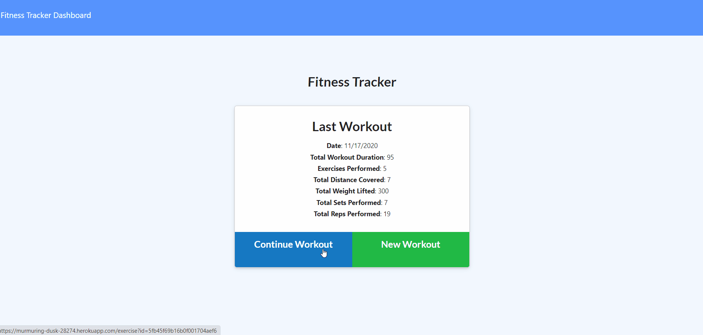
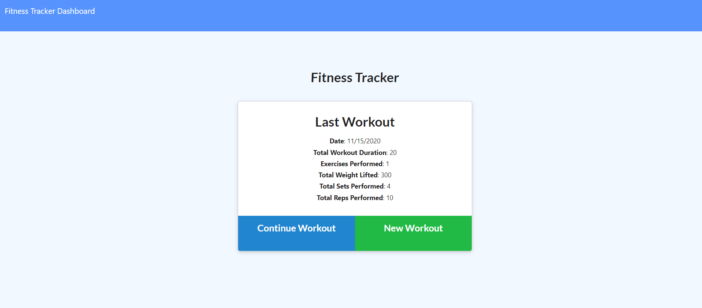
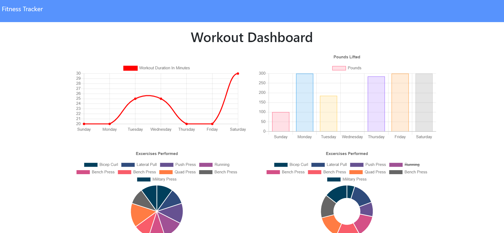

# workout-tracker

##### Table of Contents
- [Description](#Description)
- [Background](#Background)
- [Instructions](#Instructions)
- [Technologies Used](#Technologies-Used)
- [Future Development](#Future-Development)
- [Credits](#Credits)

## Description
Users are able to create and track daily workouts. Users can log multiple exercises in a workout on a given day. If the user does resistance training, then they can track the name of the workout, type, weight, sets, reps, and duration of the workout. If the exercise is cardio, then the user can track the name, duration, and distance. 

This application can be accessed [here](https://murmuring-dusk-28274.herokuapp.com/)

## Background
The development of this application, initially, was an exercise in creating a back-end to an existing front-end. Trilogy created the front-end, complete with various AJAX requests. I then created the database, set up the ORM, and developed the express server and routes. Doing so helped me focus on improving my back-end skills. Now that the application is complete, I look forward to adding various features to grow the application into a more complete experience. The live application is hosted on Heroku with MongoDB Atlas as the cloud-based database.

## Instructions
1. To add an exercise to a workout that aleady has exercises on it, click "Continue oWrkout". To add exercises to a new workout, click "New Workout". 
2. Choose whether the added exercise is cardio or resistance. 
3. Add further details about the workout, like the duration.
4. When finished adding details, click "Add Workout". If adding is successful, a green message will pop-up confirming the addition.
5. Click "Dashboard" to view overall statistics. 

## Technologies Used
- HTML
- CSS
- JavaScript
- Node.js
- Express.js
- morgan
- MongoDB (local)
- Mongoose
- Github
- Heroku
- MongoDB Atlas

## Future Development
I look forward adding the following features:
- Weight tracking
- Tracking progress towards a specific fitness goal
- A feature that suggests exercises based on the user's input of fitness goals 
- A feature that allows the quick adding of frequently completed exercises
- Offline use through a service worker

## Credits
- Trilogy developed the front-end
- Gif of application function was created with [ScreenToGif](https://www.screentogif.com/)